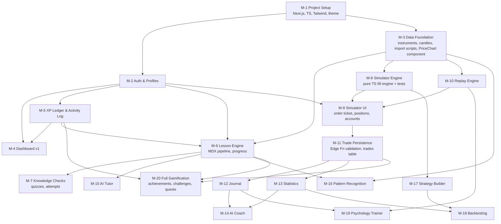

# MILESTONE_DEPENDENCIES.md

# Trading Academy — Milestone Dependency Graph

Milestone IDs (M-x) are now referenced in FEATURE_ROADMAP.md. An arrow means "requires."
Key structural finding: **M-3 (Data Foundation) is a hidden prerequisite** for everything chart-related and was missing from the original roadmap — it has been added to Phase 1.

## Graph

## Critical path
M-1 → M-3 → M-8 → M-9 → M-11 → M-13 → M-14

The simulator chain is the longest and highest-risk path; the AI Coach (a headline feature) sits at its end. Lessons (M-6/M-7) run in parallel off M-2/M-3, which is why Phase 2 and early Phase 3 work can interleave.

## Parallelizable pairs (useful for 1–2 hr work sessions)
- M-6 Lesson Engine ∥ M-8 Simulator Engine (no shared code beyond M-3)
- M-12 Journal ∥ M-13 Statistics (both read `trades`, touch nothing shared)
- M-16 Pattern Recognition ∥ M-20 Gamification

## Ordering corrections vs. the original roadmap
1. **M-3 Data Foundation added to Phase 1.** Original roadmap had no data milestone at all; simulator/replay/lessons-with-charts all silently depended on it.
2. **XP ledger (M-5) pulled from Phase 8 into Phase 1.** Lessons grant XP in Phase 2; retrofitting a ledger under a live counter is exactly the migration ADR-009 exists to avoid. Only the *ledger* moves early — achievements/challenges/quests stay in Phase 8 (M-20).
3. **Simulator engine (M-8) split from simulator UI (M-9).** The pure engine is the most test-critical module (ADR-010) and blocks both replay trading and backtesting; building it UI-first would couple them.
4. **Trade persistence (M-11) is its own milestone.** Journal, stats, coach, and gamification all hang off the `trades` table; it deserves explicit Definition-of-Done treatment rather than being an afterthought of the simulator UI.
